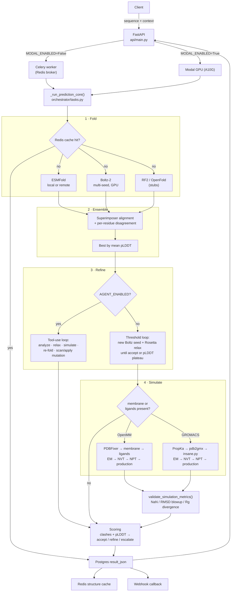

# ProPredict

Agentic protein structure prediction service. Takes an amino-acid sequence plus **environmental
context** (pH, ions, membrane, ligands), predicts the 3D structure through one or more folding
backends, optionally refines it (Rosetta relax, re-seeding, MD simulation, structure-aware
mutation), and returns a scored PDB with an accept / refine / escalate decision.

Two things distinguish it from a thin wrapper around a folding model:

1. **Context is a first-class input.** pH drives PropKa protonation states; a membrane spec
   triggers bilayer embedding; ligand SMILES trigger docking and force-field parameterization.
2. **The refinement policy is a tool-use agent**, not a fixed script. With `AGENT_ENABLED=True`
   a Claude-style tool loop decides what to run next (relax, re-fold, simulate, scan mutations,
   apply a mutation, accept, escalate). With it off, a deterministic threshold loop makes the
   same decisions.

> **Project status.** This is a research codebase under active development, not a production
> service. Stages A–F of the original roadmap are complete; the mutation stack is complete
> through single-site scoring and has a working combinatorial search that is **not yet wired
> into the pipeline**. See [Known gaps](#known-gaps) for an honest list of what does not work.

---

## Architecture



**Two execution modes**, selected by `MODAL_ENABLED`:

| Mode | Dispatch | Used for |
|---|---|---|
| Local / Docker (`False`) | FastAPI → Celery task → local worker | development, CPU/MPS ESMFold |
| Modal (`True`) | FastAPI → `modal_app.py::run_prediction` on an A10G | Boltz-2, benchmarks, real agent runs |

Both call the same entry point, `_run_prediction_core(request_data: dict, progress_cb=None)`.
Keeping that dict-in signature identical is what lets one pipeline serve both transports;
each wrapper relays `progress_cb(percent, stage)` to its own channel (Celery `update_state`,
Modal `modal.Dict`).

### Repository layout

| Path | Responsibility |
|---|---|
| `api/main.py` | FastAPI endpoints, Celery/Modal dispatch, Postgres-backed job store |
| `config.py` | **Single source of truth** for every env var and feature flag |
| `models/schemas.py` | Pydantic v2 request/response models (incl. webhook SSRF validator) |
| `models/database.py` | SQLAlchemy `Job` model, `init_db()`, `get_db()` |
| `orchestrator/tasks.py` | Celery app, cache, webhook, `_run_prediction_core`, refinement loop |
| `orchestrator/progress.py` | Stage names, percents, Celery-state → status mapping (import-light) |
| `orchestrator/backends/esmfold.py` | ESMFold local (lazy-loaded) + remote API, pLDDT parsing |
| `orchestrator/backends/boltz.py` | Boltz-2 CLI wrapper (YAML in, CIF → PDB out) |
| `orchestrator/backends/stubs.py` | RoseTTAFold2 / OpenFold placeholders |
| `orchestrator/ensemble.py` | Inter-model alignment + per-residue CA RMSD disagreement |
| `orchestrator/simulation.py` | Rosetta FastRelax, PropKa protonation, GROMACS + OpenMM MD |
| `orchestrator/membrane.py` | insane.py (GROMACS) and CHARMM36m `addMembrane` (OpenMM) |
| `orchestrator/ligands.py` | RDKit ETKDG conformers, GNINA/Vina docking, ACPYPE/OpenFF params |
| `orchestrator/scoring.py` | Clash detection, decision logic, MD trajectory validation |
| `orchestrator/agent.py` | Tool-use refinement loop + tool handlers |
| `orchestrator/mutation_scan.py` | ProteinMPNN single-site structural scorer (standalone + CLI) |
| `orchestrator/mutation_search.py` | Fitness oracles + AdaLead-lite combinatorial search |
| `modal_app.py` | Modal image definitions, GPU worker, real-binary tool smoke tests |
| `benchmarks/` | CASP15 / ProteinGym / affinity harnesses + `BENCHMARKS.md` |
| `Process/` | One write-up per completed task — what was done, why, decisions made |
| `mutation-plans/`, `research_plan/` | Task plans written before implementation |

---

## Quick start

### Docker (everything)

```bash
cp .env.example .env          # defaults work for local ESMFold on CPU
docker compose up
```

Brings up Postgres, Redis, the API (`:8000`), a Celery worker, and Flower (`:5555`).
The first prediction downloads `facebook/esmfold_v1` (~2 GB) into the worker's cache.

The Celery image also bakes in GROMACS, the CHARMM36m force field, OpenMM/RDKit/OpenFF/Vina
via conda-forge, and a ProteinMPNN clone at `/opt/ProteinMPNN`.

### Local (no Docker)

```bash
conda env create -f environment-conda.yml   # optional MD / ligand / Rosetta tools
conda activate propredict
pip install -r requirements.txt

# needs Postgres + Redis reachable
uvicorn api.main:app --host 0.0.0.0 --port 8000 --reload
celery -A orchestrator.tasks worker --loglevel=info
```

### Submit a prediction

```bash
curl -X POST http://localhost:8000/predict \
  -H "Content-Type: application/json" \
  -d '{
    "sequence": "MKTAYIAKQRQISFVKSHFSRQDILDLWQYVQG",
    "context": {"pH": 7.4, "temperature_c": 25},
    "priority": "fast"
  }'
```

---

## API

| Method | Path | Returns |
|---|---|---|
| `GET` | `/health` | liveness |
| `POST` | `/predict` | `JobStatus` — enqueues the job, returns `run_id` |
| `GET` | `/predict/{run_id}` | full `PredictionResponse` (predictions, ensemble, post-processing) |
| `GET` | `/predict/{run_id}/status` | `JobStatus` with real per-stage `progress_percent` + `stage` |
| `GET` | `/predict/{run_id}/pdb` | final structure as a PDB download |
| `GET` | `/predict/{run_id}/simulation-pdb` | post-solvation system (waters, ions, lipids, ligands) |

Request fields: `sequence` (≤2000 aa, standard 20 letters), `context`, `priority`
(`fast` / `accurate` / `constraint_driven`), `job_timeout_seconds`, optional `run_id`,
optional `webhook_url`.

`webhook_url` is validated at the schema layer: HTTPS only, and the hostname is DNS-resolved
and rejected if it lands on a private, loopback, link-local, or reserved address. Do not
weaken this — it is the SSRF guard.

Progress stages are `folding` (10%) → `post_processing` (40%) → `simulation` (60%) →
`finalizing` (90%), defined in `orchestrator/progress.py` and reported identically by both
transports.

---

## Environmental context

```json
{
  "pH": 7.4,
  "temperature_c": 25,
  "ions": {"Na+": 150, "Cl-": 150},
  "membrane": {"type": "POPC", "span": [20, 45]},
  "ligands": [{"name": "ATP", "smiles": "...", "binding_site": [45, 46]}],
  "mutations": [{"pos": 12, "from": "A", "to": "V"}],
  "constraints": {}
}
```

| Field | Effect |
|---|---|
| `pH` | PropKa3 per-residue pKa → protonation states for HIS/ASP/GLU passed to `pdb2gmx` / `addHydrogens` |
| `temperature_c` | thermostat setpoint for NVT/NPT equilibration and production MD |
| `ions` | ion species/concentration for `genion` / OpenMM solvation |
| `membrane` | triggers insane.py (GROMACS) or Modeller `addMembrane` with CHARMM36m (OpenMM) |
| `ligands` | SMILES → RDKit ETKDG conformer → GNINA or Vina docking → ACPYPE GAFF2 or OpenFF SMIRNOFF params |
| `constraints` | reserved for a future constraint-driven backend (Chai-1); not consumed yet |

Presence of `membrane` or `ligands` is what triggers the MD stage at all.

---

## Prediction backends

| Backend | Quality | Hardware | Enable |
|---|---|---|---|
| **ESMFold** (local) | good, single-sequence | CPU / MPS / CUDA | default; `ESMFOLD_LOCAL=True` |
| **ESMFold** (remote) | same, via esmatlas API | none | `ESMFOLD_LOCAL=False` |
| **Boltz-2** | AlphaFold3-class | GPU (A10G+) | `BOLTZ_ENABLED=True` + `pip install git+https://github.com/jwohlwend/boltz` |
| RoseTTAFold2 | stub — raises | GPU | `ROSETTAFOLD_ENABLED` |
| OpenFold | stub — raises | GPU | `OPENFOLD_ENABLED` |

ESMFold is deterministic, so it runs once regardless of `ENSEMBLE_NUM_SEEDS`. Boltz-2's
diffusion sampling is stochastic, so it runs `ENSEMBLE_NUM_SEEDS` random seeds and the
refinement loop can spend more. The best prediction is picked by mean pLDDT; when two or more
*distinct models* succeed, `align_and_compare_structures()` superimposes them and reports
per-residue CA RMSD plus high-disagreement stretches.

Implementation notes worth knowing before touching this code:

- **Boltz-2 runs as a CLI subprocess** (`boltz predict` on a generated YAML), not via a Python
  API. Output CIF is converted to PDB in `_cif_to_pdb`.
- **pLDDT is always 0–100** in this codebase. ESMFold writes 0–1 in the B-factor column, so the
  parser multiplies by 100.
- **PDB files are strings**, held in task results and Postgres `result_json` — never written to
  disk as pipeline state.
- **The ESMFold model lazy-loads** once per worker. Never import it at module level.

---

## The mutation stack

Three layers, cheap to expensive. All structure-aware via ProteinMPNN (Dauparas et al. 2022,
MIT-licensed; the clone ships its own ~26 MB weights).

### 1. Single-site scoring — `orchestrator/mutation_scan.py`

```
score(pos, wt → mut) = log P(mut | backbone, rest of sequence)
                     − log P(wt  | backbone, rest of sequence)
```

Positive = ProteinMPNN considers the substitution more structurally compatible than wild-type.
**This is structural compatibility, not fitness, stability, or function** — the tool
description, the agent system prompt, and any UI surfacing these numbers say so explicitly, and
the validation below shows exactly where it is weakest.

Reproducibility is a hard constraint here. ProteinMPNN's `conditional_probs_only` pass draws a
random decoding order per forward pass, and its CLI does `if args.seed:` — so **`--seed 0` means
"unseeded"** and silently randomizes. Scores are therefore the mean log-odds over
`PROTEINMPNN_NUM_DECODING_ORDERS` (default 8) orders at a fixed **non-zero** seed
(`PROTEINMPNN_SEED`, default 37), and `seed=0` is rejected with an explanatory error. Scores are
only comparable within a fixed `(seed, num_decoding_orders, model_name, structure)` tuple.

Run it standalone:

```bash
python -m orchestrator.mutation_scan --pdb myprotein.pdb --sequence MKT... --top-k 10
```

### 2. Agent tools — `scan_mutations` and `apply_mutation`

`scan_mutations` is read-only: it ranks substitutions, optionally restricted to given positions.
`apply_mutation` mutates the sequence, re-folds, and compares. They are deliberately **not**
chained internally — the agent decides whether to scan before applying. `AGENT_MAX_MUTATIONS`
(default 3) caps mutations per session independently of `AGENT_MAX_ITERATIONS`. If
`PROTEINMPNN_PATH` is unset the tool reports "unavailable" and the agent falls back gracefully
rather than crashing.

### 3. Combinatorial search — `orchestrator/mutation_search.py`

Two batched fitness oracles (higher = better, always):

| Oracle | What it does | Cost | Sees epistasis? |
|---|---|---|---|
| `additive_oracle` | sums single-site log-odds from one WT conditional-probs pass | ~free | **no** |
| `score_only_oracle` | threads each mutant onto the WT backbone, `--score_only --path_to_fasta`, returns negated `global_score` | one subprocess per round (whole batch) | **yes** |

Searching over the additive oracle is vacuous — the optimum of a sum of independent per-site
terms is just the best substitution at each site, no search required. So the search loop uses the
`score_only` oracle; additive is for seeding and pre-filtering. A third tier (re-fold the top
handful, score by pLDDT/clashes/affinity, capped by `MUTATION_SEARCH_MAX_REFOLDS`) is designed
but not yet built.

`adalead_search(...)` is a hand-rolled AdaLead-lite (no `flexs` dependency — it is unmaintained
and pulls TensorFlow). Two deliberate, documented deviations from textbook AdaLead:

- **No greedy rollout.** Textbook AdaLead grows candidates one residue at a time against a cheap
  *surrogate*. Here ProteinMPNN is simultaneously the scorer and the thing being optimized, so a
  rollout would hit the expensive oracle once per step. Dropping it costs sample efficiency and
  leans harder on λ, rounds, and crossover; between-round elitism recovers the greedy-around-best
  behaviour. What remains is honestly an elitist GA with uniform crossover and capped random
  mutation.
- **Range-normalized elite band** (`fitness ≥ max − κ·(max − min)`, default κ=0.5) instead of
  FLEXS's multiplicative band, which collapses to `[0,0]` when max fitness ≈ 0 and would exclude
  the below-best singles an epistatic pair needs to be fused from. **κ here is not comparable to
  FLEXS's 0.05.**

Determinism contract: every draw goes through `np.random.default_rng(seed)` and samples only from
ordered structures — never by iterating a `set`, whose order varies with per-process hash
randomization. Same `(inputs, seed)` → identical result.

---

## MD simulation

Triggered when the context has a membrane or ligands **and** a backend is enabled.
`OPENMM_ENABLED` takes priority over `GROMACS_ENABLED`.

- **GROMACS:** PropKa → `pdb2gmx` (pH-aware protonation) → `editconf` → insane.py bilayer →
  `solvate` → `genion` → EM → NVT → NPT → production → RMSD/Rg.
- **OpenMM:** PDBFixer → `addHydrogens(pH)` → CHARMM36m `addMembrane` → ligand parameters →
  solvate → EM → NVT → NPT → production → RMSD/Rg.

`MD_PRODUCTION_NS` (default 0.1 ns) sets production length. Afterwards
`validate_simulation_metrics()` escalates the job when the trajectory looks unphysical: NaN
energies, CA RMSD above `SIM_RMSD_MAX_NM` (2.0 nm), or Rg diverging by more than
`SIM_RG_DIVERGENCE_FACTOR` (3×). The reason lands in `post_processing.validation_reason`.

---

## Configuration

Everything goes through `config.py` via `os.getenv()`, mirrored in `.env.example`. Never hardcode
a new setting; add it in both places. `config.py` calls `load_dotenv(override=True)`, which
matters inside Docker — see the `PROTEINMPNN_PATH` note in `docker-compose.yml`.

**Feature flags gate every optional tool.** Each must be installed separately *and* enabled. Code
must always check the flag before assuming availability.

| Tool | Flag | Install |
|---|---|---|
| PyRosetta | `ROSETTA_ENABLED` | `conda install -c rosettacommons pyrosetta` |
| GROMACS | `GROMACS_ENABLED` / `GROMACS_BIN` | `brew install gromacs` · `apt-get install gromacs` |
| OpenMM | `OPENMM_ENABLED` | `conda install -c conda-forge openmm` |
| Boltz-2 | `BOLTZ_ENABLED` | `pip install git+https://github.com/jwohlwend/boltz` (GPU) |
| GNINA | `GNINA_BIN` | [gnina releases](https://github.com/gnina/gnina/releases) |
| Vina / RDKit / OpenFF | — | `environment-conda.yml` |
| insane.py | `INSANE_PATH` | [cgmartini.nl](http://cgmartini.nl) |
| ProteinMPNN | `PROTEINMPNN_PATH` | `git clone https://github.com/dauparas/ProteinMPNN.git` |
| Agent loop | `AGENT_ENABLED` + `AGENT_API_KEY` | `pip install anthropic` |
| Mutation search | `MUTATION_SEARCH_ENABLED` | none (numpy only) |

Other knobs worth knowing:

| Var | Default | Meaning |
|---|---|---|
| `ENSEMBLE_NUM_SEEDS` | 1 | Boltz-2 seeds sampled in the initial fold |
| `REFINEMENT_MAX_ITERATIONS` | 10 | refinement loop budget |
| `REFINEMENT_PLDDT_PLATEAU_DELTA` | 0.5 | stop when an iteration improves pLDDT by less than this |
| `PLDDT_ACCEPT_THRESHOLD` / `_REFINE_` | 75 / 60 | accept / refine / escalate boundaries |
| `BOLTZ_USE_MSA` | False | query the ColabFold MSA server — large accuracy win, ~2.5× slower |
| `CACHE_TTL` / `REDIS_CACHE_PREFIX` | 86400 s | Redis structure-result cache |
| `AGENT_MODEL` / `AGENT_BASE_URL` | — | agent backend; any Anthropic-compatible endpoint works |

The agent reads `AGENT_API_KEY` / `AGENT_BASE_URL` / `AGENT_MODEL` rather than
`ANTHROPIC_API_KEY` directly, so a compatible endpoint can be swapped in for testing.

**Never commit `.env` or API keys.** `.env.example` carries placeholders only.

---

## The agent loop

With `AGENT_ENABLED=True` and `AGENT_API_KEY` set, `run_agent_refinement()` runs a tool-use loop
over the current structure. Tools:

| Tool | Effect |
|---|---|
| `analyze_structure` | pLDDT stats, low-confidence regions, clash count |
| `run_rosetta_relax` | FastRelax; returns new PDB + Rosetta energy |
| `run_simulation` | OpenMM/GROMACS MD with the request's pH / temperature / membrane / ligands |
| `run_boltz_prediction` | re-fold with a new Boltz-2 seed |
| `scan_mutations` | rank substitutions by ProteinMPNN structural log-odds (read-only) |
| `apply_mutation` | mutate, re-fold, compare |
| `accept_structure` | terminal — accept with reasoning |
| `escalate_structure` | terminal — flag for human review |

The initial prompt includes inter-model disagreement regions when 2+ backends ran. Iterations are
capped by `AGENT_MAX_ITERATIONS`. If `anthropic` is missing or `AGENT_API_KEY` is empty, the loop
degrades silently to `compute_post_processing()` threshold logic.

With `AGENT_ENABLED=False`, the deterministic path is: score → while the decision is
refine/escalate and budget remains, try a new Boltz-2 seed and/or Rosetta relax → re-score →
break on pLDDT plateau → run MD if the context calls for it.

One behavioural asymmetry to be aware of: **the pipeline-level MD block lives in the non-agent
branch.** When the agent is enabled, simulation happens only if the agent calls `run_simulation`
itself.

---

## Modal (GPU)

```bash
modal run modal_app.py::run_prediction        # single prediction on an A10G
modal run modal_app.py::test_boltz_gpu --sequence MKTAYIAK
modal run modal_app.py::test_membrane_modal   # real insane.py / CHARMM36m coverage
modal run modal_app.py::test_ligands_modal    # real ACPYPE / Vina / RDKit / OpenFF coverage
modal run modal_app.py::test_gnina_modal      # real GNINA on a dedicated CUDA image (T4)
modal run benchmark_modal.py                  # CASP15 benchmark suite
modal deploy modal_app.py
```

The `test_*_modal` functions exist because the local suite mocks every external binary; these give
the real tools genuine coverage on a GPU box. GNINA rides a **separate** `gnina_image` (prebuilt
v1.3 binary on `nvidia/cuda:12.2.2-runtime-ubuntu22.04`) — it has no conda package and the
official image is Python 3.6, and keeping it separate stops the CUDA layer from bloating every
other function.

Secrets:

```bash
modal secret create propredict-secrets \
  BOLTZ_ENABLED=True BOLTZ_DIFFUSION_SAMPLES=1 BOLTZ_SAMPLING_STEPS=200 \
  ESMFOLD_LOCAL=True MODAL_ENABLED=True GROMACS_ENABLED=True OPENMM_ENABLED=True
```

---

## Benchmarks

Full history with per-run configs lives in [`benchmarks/BENCHMARKS.md`](benchmarks/BENCHMARKS.md);
machine-readable rows in `benchmarks/results.jsonl`, optionally mirrored to Weights & Biases via
`python benchmarks/log_benchmark.py <results.json> --wandb-project ...`.

**Boltz-2 on CASP15** (88 targets, 74 succeeded; single sample, 200 diffusion steps):

| Config | TM mean | TM median | RMSD mean | pLDDT |
|---|---|---|---|---|
| No MSA (runs 001 / 006, reproduced) | 0.503 | 0.401 | 11.8 Å | 69 |
| **MSA via ColabFold** (run 010, 10-target subset) | **0.871** | **0.967** | **3.1 Å** | **90** |

MSA is transformative on hard targets — 7TY4 (515 aa) goes 0.22 → 0.99, 7V3F 0.15 → 0.65 — at
roughly 2.5× the wall time. The no-MSA baseline reproduced to within 0.0003 TM across separate
runs, so Boltz-2's diffusion stochasticity is negligible at 200 steps.

**ProteinMPNN scorer vs ProteinGym DMS** (validation gate; scored on ESMFold-*predicted*
structures, not crystal structures; seeded, 8 decoding orders, `v_48_020`):

| Assay | Category | L | n | Spearman ρ |
|---|---|---|---|---|
| `TCRG1_MOUSE_Tsuboyama_2023_1E0L` | stability | 37 | 1058 | +0.756 |
| `ESTA_BACSU_Nutschel_2020` | stability | 212 | 2172 | +0.434 |
| `CCDB_ECOLI_Adkar_2012` | activity | 101 | 1176 | +0.327 |

ProteinMPNN's published zero-shot ProteinGym average is ~0.29–0.31, so these sit in range to well
above. The ordering is the informative part: **stability assays beat the activity assay**, exactly
as expected for a structural-compatibility score — that is the scorer's known blind spot, not a
bug. The 212-residue ESTA is the representative real-protein data point; the 37-mer's ρ=0.76 is
typical of tiny stability assays and should not be read as general strength.

**Checkpoint selection** (`benchmarks/benchmark_proteinmpnn_checkpoints.py`; 4 checkpoints ×
3 seeds × 3 assays): seed noise is tiny (std 0.0003–0.0028) and per-assay differences are real,
but **no checkpoint dominates** — v_48_002 wins the 37-mer, v_48_030 the 212-mer, v_48_010 the
activity assay. On the 3-assay mean, v_48_020 (+0.506) and v_48_002 (+0.504) tie within sampling
error. **Decision: keep `v_48_020`.** The "higher decoding noise should help because we re-fold
afterwards" hypothesis is *not* supported in general — it holds on one assay and reverses on the
other two.

---

## Testing

Unit tests are fully mocked at the subprocess/API boundary — no GPU, no GROMACS, no network.

```bash
pytest tests/test_boltz.py            # fastest feedback loop; run after any orchestrator change
pytest tests/test_orchestrator.py     # pipeline, progress, simulation validation
pytest tests/test_mutation_scan.py tests/test_mutation_search.py
pytest tests/test_ligands.py tests/test_membrane.py
pytest tests/test_agent.py
pytest tests/test_api.py              # needs Postgres — init_db() runs on import
pytest -k integration                 # needs real tools installed
```

`pytest.ini` sets `--continue-on-collection-errors` so one missing optional dependency cannot
abort collection of the whole suite.

Two traps:

- `tests/test_api.py` calls `init_db()` at import time. Any new test file importing `api.main`
  needs Postgres or a mocked `models.database.init_db`.
- Optional deps (`pyrosetta`, `openmm`, `boltz`) must never be imported at module top level —
  guard with try/except or the feature flag.

---

## Known gaps

An honest list of what is incomplete or wrong today.

- **Boltz-2 affinity is fixed but not yet confirmed on real output.** The backend now reads
  `affinity_pred_value` and `affinity_probability_binary` (it previously read a key called
  `affinity`, which Boltz never writes — so `affinity_score` was `None` on every run ever). The
  value is **log10(IC50) with IC50 in µM**, not kcal/mol; all labels were corrected, since the
  agent reasons over that number. Local coverage is mock-only — and a mock encoding the wrong
  key is what hid the bug for months — so a ligand-bearing Modal run is still needed to confirm
  the keys end-to-end. See [`Process/boltz-affinity-key-fix.md`](Process/boltz-affinity-key-fix.md).
- **`call_boltz` can only build one protein chain**, so obligate homodimers (e.g. HIV-1 protease,
  whose active site forms at the dimer interface) cannot be modelled at all. Boltz accepts
  `id: [A, B]`; the backend needs a chain-multiplicity argument and ligand chain IDs shifted to
  avoid collision.
- **The combinatorial mutation search is not wired into anything.** `adalead_search` and both
  oracles are implemented and tested against in-memory oracles, but nothing outside `tests/`
  imports `orchestrator.mutation_search`. Remaining: tier-3 re-fold funnel (P2-3), agent tool +
  CLI (P2-4), validation write-up (P2-5) — see `mutation-plans/Process-plan-phase2.md`.
- **RoseTTAFold2 and OpenFold are stubs** that raise; the flags exist so the ensemble code path is
  exercised.
- **Chai-1 is unbuilt.** `context.constraints` is accepted by the schema and consumed by nothing.
  It is non-commercially licensed, so it would ship behind a `CHAI1_ENABLED` flag.
- **MD does not run on the agent path** unless the agent explicitly calls `run_simulation` (see
  [The agent loop](#the-agent-loop)).
- **No full 88-target CASP15 run with MSA enabled yet** — the 0.871 TM figure is a 10-target
  subset and is not directly comparable to the 88-target baseline.
- `ROADMAP.md` still lists the mutation workflow, simulation validation, and progress reporting as
  remaining; all three have since landed (see `Process/`).

---

## Working conventions

If you are contributing — or driving this with an AI assistant — the rules in `CLAUDE.md` are
load-bearing:

- **Step by step.** One sub-task per pass; discuss the next before starting it.
- **Discuss before acting.** Propose the plan, get sign-off, then write code.
- **Document in `Process/`.** Every completed step gets a short write-up: what was done, why, what
  was decided, sources cited. Plans go in `mutation-plans/` or `research_plan/` *before*
  implementation. This is why the repo can explain its own history — the ProteinMPNN determinism
  bug, the checkpoint decision, and the AdaLead deviations are recorded there rather than only in
  commit messages.
- **Pydantic v2** — `model_dump()`, never `.dict()`.
- **Celery app** lives in `orchestrator/tasks.py`, not a separate `celery.py`.

---

## License

See [`LICENSE`](LICENSE).

## Credits

ESMFold (Lin et al., Meta AI) · Boltz-2 (Wohlwend et al., MIT) · ProteinMPNN (Dauparas et al.,
2022, *Science*) · AdaLead (Sinai et al., 2020) / FLEXS · ProteinGym (Notin et al.) · PropKa3 ·
GROMACS · OpenMM · PDBFixer · RDKit · Open Force Field · AutoDock Vina · GNINA · insane.py
(Wassenaar et al.) · CHARMM36m (MacKerell lab) · BioPython · PyRosetta.
