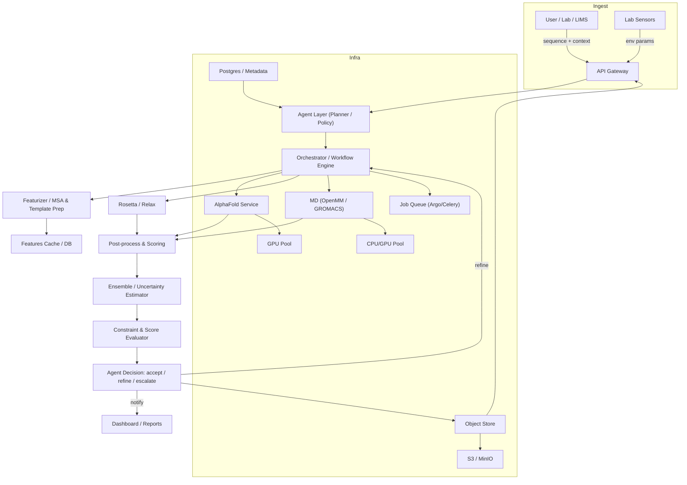

# ProPredict
Protein Modeling Service implementing Agentic AI Framework

Uses ESMFold (local, CPU-friendly), PyRosetta, and GROMACS with an agentic orchestrator for accurate protein structure prediction.
Runs on any platform (ARM64 or x86). Docker images auto-detect the host architecture.

## Local ESMFold Setup

By default ProPredict runs ESMFold locally via HuggingFace Transformers — no external API key required.

```bash
# Install Python deps (includes torch + transformers)
pip install -r requirements.txt

# Copy and configure env
cp .env.example .env
# ESMFOLD_LOCAL=True is the default — no changes needed for local inference

# Start all services
docker compose up
```

On first run the worker downloads the `facebook/esmfold_v1` weights (~2 GB) and caches them.
Set `ESMFOLD_LOCAL=False` to fall back to the public `api.esmatlas.com` endpoint instead.

# Architecture & Implementation Diagram — ProPredict

Below is a compact, runnable design for an agentic protein-modeling service that composes pretrained tools (AlphaFold, Rosetta, MD engines) and makes context-aware decisions.

## High-level architecture (Mermaid)


## Core components
- API Gateway: accept sequence + structured context (pH, temp, ligands, membrane, mutations, constraints), auth, webhooks.
- Agent Layer (planner/policy): inspects input + history, selects pipeline and stopping criteria. Implements rules and learned surrogate gating.
- Orchestrator: schedules tasks, handles retries, caches results, parallelizes runs.
- Featurizer: builds MSAs, template picks, constraint files for Rosetta/MD per context.
- Model services: containerized AlphaFold inference, Rosetta relax/refine, optional MD engines (OpenMM/GROMACS).
- Post-processing: structural scoring (pLDDT, TM-score surrogate), clash detection, energy eval, ML-based uncertainty.
- Ensemble & Uncertainty: combine predictors; compute region-level uncertainty; decide refinements.
- Storage & provenance: S3 for artifacts; Postgres for metadata, audit trail.
- UI / API: results visualization (NGL/Mol*), run logs, parameter editing.

## Dataflow (step-by-step)
1. Client posts sequence + context to API.
2. Agent policy chooses pipeline variant (fast vs. accurate) based on context and budget.
3. Orchestrator runs Featurizer (MSA, templates) — cached by hash(context+seq).
4. Run AlphaFold (multiple seeds/settings if needed).
5. Score predictions; if low confidence or constraints unmet, call Rosetta relax or guided refinement.
6. If dynamics required, run short MD to validate flexible regions.
7. Ensemble outputs; compute uncertainty; Agent decides to accept, refine, or flag for human review.
8. Store artifacts and metadata; notify user via webhook/UI.

## Example API schema
```json
{
  "sequence": "MKTAYIAKQRQISFVKSHFSRQDILDLWQYVQG",
  "context": {
    "pH": 7.4,
    "temperature_c": 25,
    "ions": {"Na+": 150, "Cl-": 150},
    "membrane": {"type":"POPC","span":[20,45]},
    "ligands": [{"name":"ATP","binding_site":[45,46]}],
    "mutations": [{"pos":12,"from":"A","to":"V"}],
    "priority": "accurate"
  },
  "callbacks": {"webhook":"https://..."},
  "run_id": "optional-client-id-123"
}
```

## Agent policies (examples)
- Fast policy: run AlphaFold single-pass; if mean pLDDT < 70 -> run Rosetta relax; else return.
- Accurate policy: run AlphaFold with templates & multiple seeds, ensemble + Rosetta; if ensemble variance > threshold -> run 10 ns MD for flagged regions.
- Constraint-driven: if experimental crosslinks present -> enforce constraints during Rosetta/MD and re-evaluate.

## Orchestration & caching rules
- Cache key: sha256(sequence + sorted(context JSON) + pipeline config).
- Cache MSAs and templates separately to reuse across similar sequences.
- Use job queue with priority weighting from context.priority.

## Scoring & decision thresholds (suggested)
- Accept if mean pLDDT > 80 and no steric clashes and energy < threshold.
- Refine if mean pLDDT 60–80 or region pLDDT variance high.
- Escalate to human if mean pLDDT < 60 or constraints violated.

## Deployment & infra (minimal to production)
- Local dev: Python + Celery/Redis + Dockerized AlphaFold minimal or remote AF API.
- Small cluster: Kubernetes + Argo workflows, GPU node pool, MinIO, Postgres.
- Production: K8s autoscaling for GPUs, S3, Prometheus + Grafana, RBAC, audit logs.

## Roadmap / milestones
1. ~~MVP: API + orchestrator + remote ESMFold API + caching + basic agent policy.~~ DONE
2. ~~Migrate to local ESMFold inference (CPU/MPS/CUDA, no external API required).~~ DONE
3. Add Boltz-2 as high-accuracy GPU backend.
4. Add Chai-1 specialist backend for experimental constraints.
5. Implement UI with NGL, run history, and webhooks.
6. Implement surrogate gating model and active learning with experimental data.

## TODO
- Scaffold API endpoint + orchestrator skeleton (I can generate a Python Flask/FastAPI + Celery scaffold).
- Create container spec for AlphaFold inference or integrate EBI AF API with retries.
- Implement feature hashing & cache table in Postgres.

Checklist for me to scaffold next:
- Scaffold FastAPI + Celery orchestrator
- Generate example feature hashing + cache implementation
- Create minimal AlphaFold-call adapter with retries
- Produce mermaid sequence diagram for a specific pipeline
